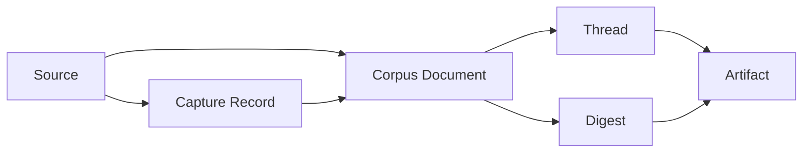

# Tino AI 2.0 核心对象与主循环

> 日期：2026-04-26
> 角色：冻结当前阶段核心对象模型与主循环
> 状态：最新共识

## 1. 这份文档解决什么问题

如果没有稳定对象模型，产品讨论会不断在“知识库”“项目”“聊天”“topic”“笔记”之间漂移。

当前阶段只需要冻结少量关键对象，不需要一次性发明完整宇宙。

## 2. 核心对象

### 2.1 `Project`

一个工作域。

例子：

- 一部长篇小说
- 一个大模型微调研究专题
- 一个默认收藏与剪贴板沉淀池

### 2.2 `Source`

用户丢进来的原始材料。

例子：

- Markdown 文档
- PDF
- PPT
- Excel
- 网页
- 图片
- 视频
- 显式提交的文本片段

### 2.3 `Capture Record`

输入适配器和 capture pipeline 产生的原始捕获记录。

例子：

- 某次剪贴板捕获
- 某次选中内容发起 AI
- 某次快速输入

它的价值是：

- 回溯
- 暂存
- 过滤与去重

它不是正式知识资产。

### 2.4 `Corpus Document`

从 `source` 或 `capture record` 归一出来的 Markdown 语料文档。

这是 AI 主要工作的对象。

关键要求：

- 可追溯
- 可引用
- 与原始 source 建立 provenance 绑定

### 2.5 `Thread`

围绕某个主题逐步形成的连续脉络。

它比 `topic` 更动态，更适合表达“正在形成中的工作线索”。

### 2.6 `Digest`

系统静默整理后的阶段性结果。

例子：

- 最近这个 project 里出现了哪些主要脉络
- 哪些线索值得继续追
- 哪些内容只是噪音

### 2.7 `Artifact`

AI 产出的正式结果。

例子：

- note draft
- summary
- digest note
- patch proposal
- topic proposal
- research memo

补充边界：

- `artifact` 是正式产出，不是编辑器内态
- 用户在外部工具修改 `artifact` 后，应能形成新的 revision 或回流信号

## 3. 对象关系

最简关系如下：

补充说明：

- `Source` 和 `Capture Record` 是输入与暂存层
- `Corpus Document` 是统一语料层
- `Thread` 和 `Digest` 是中间理解层
- `Artifact` 是正式产出层

## 4. 主循环

当前阶段的主循环固定为：

### 4.1 Import

用户把材料带进来：

- 导入文件
- 粘贴内容
- 剪贴板捕获
- 全局小窗输入
- 选中内容发起 AI

### 4.2 Normalize

系统把输入转换为可追溯 Markdown 语料：

- 原始 source 保留
- Markdown 语料生成
- 元数据和来源绑定

### 4.3 Route to Project

normalization 之后，不允许让 source 在 project 归属上长期悬空。

当前最小 routing 规则固定为：

1. 如果用户显式指定 target project，就进入该 project
2. 如果输入发生在某个已激活 project 上下文内，就优先进入该 project
3. 其余情况默认进入 `Inbox Project`

当前允许系统做自动归类建议，但不允许：

- 静默把材料从一个已命名 project 挪到另一个 project
- 把 project routing 完全交给不可见的模型判断

### 4.4 Grounded Ask / Research

用户围绕语料工作：

- 问答
- 检索
- 研究
- 比较
- 改写

### 4.5 Draft / Distill

系统生成阶段性结果：

- 摘要
- 研究 memo
- patch proposal
- recent digest

### 4.6 Escalate to Artifact

从 answer 升级到 artifact，不允许是无条件自动升级。

当前最小 escalation 规则固定为：

1. 先有明确 `产` 意图，或系统给出保存建议
2. 再进入 artifact proposal
3. 用户确认后，才真正写成 Markdown artifact

### 4.7 Save as Markdown Artifact

用户确认后，把结果落成 Markdown 资产。

### 4.8 Feedback Back

用户在外部工具继续修改、确认、否定或重导入结果后，这些动作应作为：

- `artifact revision`
- `feedback signal`
- `source refresh`

重新回流到系统里，而不是永远停留在首次生成时刻。

## 5. 为什么这套对象够用

它已经足够支撑：

- 小说创作项目
- 研究专题项目
- 默认 inbox 项目

同时它又没有过早引入太重的对象，比如：

- 复杂 workspace database
- 长期人格记忆宇宙
- 通用任务执行图

## 6. 一句结论

当前阶段 `Tino AI` 不需要一个庞杂对象宇宙，只需要：

> `Project -> Source / Capture -> Corpus Document -> Thread / Digest -> Artifact`
