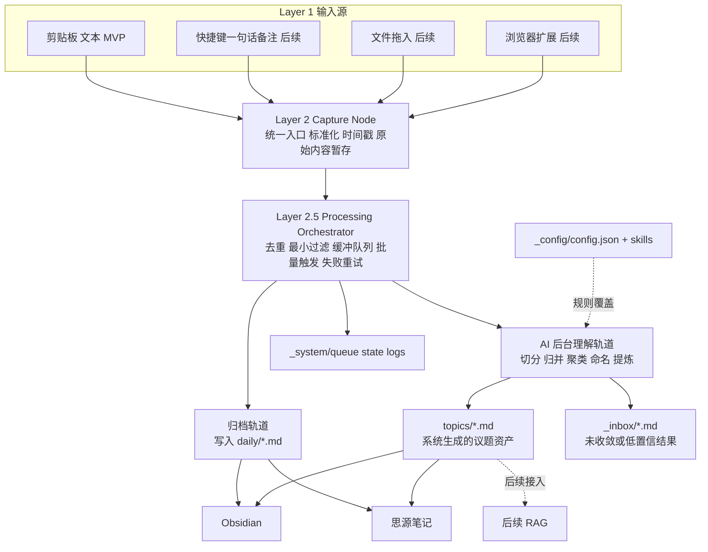

# 个人信息流软件需求原型文档

> 版本：MVP v0.1
> 日期：2026-04-06
> 来源：基于《个人信息流软件头脑风暴全过程》整理，并加入独立评审意见
> 基线说明：本版明确 `inbox-first` 为 MVP 用户心智。用户不需要先创建或理解 `topic`，系统会在后台静默生成并收敛议题。

## 1. 项目定义

这是一个以 `Markdown` 为最终知识载体、以 `macOS` 为第一落地平台的个人信息流收集工具。  
它的核心目标不是做一个新笔记软件，也不是先做 RAG，而是先把“信息低摩擦进入系统”与“AI 在后台默默整理”这两件事打通。

一句话产品意图：

> 让被信息轰炸的用户不需要先整理，只管把内容丢进来，`Tino` 在后台慢慢理解并长出议题。

一句话愿景：

> 成为用户的私人信息收件箱与后台知识编译器，而不是一个要求用户先想清楚结构的笔记软件。

产品本质上是一个 `AI` 驱动的私人信息收件箱与后台知识编译器：

- 前端尽量低摩擦地接收用户日常工作中的信息输入
- 后端将输入拆分为“原始归档”和“AI 后台理解”两条轨道
- 系统自动对混杂输入做切分、归并、聚类、命名和提炼
- 最终以 Markdown 文件落盘，供 Obsidian、思源笔记等工具直接使用

MVP 的关键前提是：

- 用户不需要先创建 `topic`
- 用户不需要先决定内容该归到哪里
- `topic` 是系统在后台从混杂输入中逐步生成出来的结果，而不是用户前台先验结构

用户主路径应理解为：

> `无负担输入 -> 后台理解与归并 -> 系统生成议题 -> 结果消费`

其中批次审阅、调试和纠偏属于隐藏干预层，不是普通用户的日常主流程。

## 2. 问题陈述

当前用户的真实痛点不是“没有笔记工具”，而是：

- 高频工作状态下，信息输入分散在剪贴板、AI 对话、IM、网页等多个入口
- 当下没有精力做手工整理、命名、归类和建目录
- 在输入当下，用户往往根本不知道它属于什么议题
- 复制过的内容、说过的话、看到的内容，大量停留在临时上下文里，之后不可追溯
- 即使已有思源笔记或 Obsidian，用户也很难在输入当下完成有效归档

因此，这个产品首先要解决的不是“知识展示”，而是“零整理负担的收口 + 后台 AI 理解与归并”。

## 3. 产品目标

### 3.1 MVP 目标

- 在不打断用户工作流的前提下，自动收集高频输入内容
- 将原始内容以流水方式保存，保证信息不丢
- 用户无需在输入前命名、建目录或创建议题
- 以批处理方式让 AI 对缓冲区内容进行切分、归并、聚类、摘要和提炼
- 让系统自动生成或更新议题，而不是要求用户先准备好议题容器
- 以 Markdown 形式将整理结果落盘到本地目录
- 让 Obsidian / 思源笔记可以直接接管这些输出
- 默认情况下不要求用户逐批审阅 AI 过程，只在异常或低置信度时进入干预层

### 3.2 非目标

- 不做完整笔记编辑器
- 不做 IM 深度接入
- 不做浏览器扩展首发版
- 不做文件拖拽首发版
- 不做 RAG / 向量数据库 / 知识问答首发版
- 不做跨端同步首发版

## 4. 独立评审结论

现有方向总体正确，但原始讨论里有三个需要收紧的点：

### 4.1 原图里缺少一个关键层：处理编排层

现有五层图里，`Capture Node` 之后直接进入 `AI 分类决策`，这在概念上不完整。  
中间至少还需要一层“处理编排层”，负责：

- 去重
- 最小安全过滤
- 缓冲区管理
- 批量触发
- 失败重试
- 归档轨道与 AI 轨道分流

如果没有这层，后面的 AI 设计、Markdown 落盘、性能与隐私约束都会混在一起。

### 4.2 “静默采集”是对的，但“零过滤”不应视为 MVP 合理状态

用户选择静默自动采集是正确的 UX 方向，但完全没有最小过滤会直接带来两个问题：

- 密码、验证码、临时复制内容会进入系统
- 噪音过多会让 AI 批处理价值迅速下降

因此，虽然“可配置过滤规则”可以后置，但“最小内建过滤”建议提升为 MVP 必备项。

### 4.3 “Markdown-first”不等于“完全没有系统态元数据”

用户知识资产应以 Markdown 为标准真相源，但系统运行仍需要轻量状态信息，例如：

- 缓冲区待处理项
- 去重 hash
- 批次状态
- 失败重试记录

这部分不必上数据库，但应允许存在于 `_system/` 之类的内部目录中，不参与用户知识结构。

## 5. 产品原则

- `Markdown-first`：用户最终资产必须是 Markdown
- `Inbox-first`：用户先投喂，系统后组织
- `Silent capture`：录入环节尽量无感，不增加确认动作
- `Result-first`：用户主要看到整理后的结果，不需要持续操作中间过程
- `Archive before intelligence`：先保留原始输入，再做 AI 提炼
- `Dual-track`：原始归档与 AI 决策物理隔离
- `Topics emerge in background`：议题由系统后台逐步长出，而不是要求用户预先定义
- `AI assists, not replaces`：AI 负责分类和提炼，不直接替用户抹除原始信息
- `Intervention only when needed`：干预层用于异常兜底、低置信度处理和高级修正，不应成为主舞台
- `Config override AI`：用户规则优先级高于默认 AI 行为
- `Privacy-first`：只有进入 AI 缓冲区的必要内容才发送给模型

## 6. MVP 范围

### 6.1 首发包含

- 平台：macOS
- 技术路线建议：Tauri + React + TypeScript
- 输入源：剪贴板文本
- 录入方式：静默自动采集
- 处理方式：批量 AI 处理
- 输出方式：Markdown 本地落盘
- 使用方式：Obsidian / 思源笔记直接读取目录

### 6.2 首发不包含

- 微信、Lark、TypeX 等 IM 直接接入
- 浏览器扩展
- 文件拖入
- 本地 RAG
- 自建数据库知识库
- 复杂设置面板
- 可视化统计和历史浏览器

## 7. 补充后的核心架构

原讨论图的主要缺口，是 `Capture Node` 与 `AI 决策` 之间缺了一层处理编排逻辑。补充后更合理的原型如下：



## 8. 关键业务流程

### 8.1 输入采集

- 系统轮询 macOS 剪贴板变化
- 检测到变化后，进入统一 Capture Node
- Capture Node 只负责标准化，不做分类判断

### 8.2 双轨分流

同一条输入进入系统后，同时进入两条轨道：

- 归档轨道：原样写入 `daily/` 流水 Markdown，仅用于备份与追溯
- AI 轨道：进入缓冲区，等待批量处理

### 8.3 批量触发

MVP 固定采用批量处理，而不是逐条实时调用模型。  
触发条件先固定为系统内置策略，例如：

- 时间窗口达到阈值
- 或累计条数达到阈值

具体阈值可后续开放配置，但不影响当前需求定义。

### 8.4 AI 决策与输出

AI 对缓冲区内容执行两步动作，对应用户最终选择的 `C` 方案：

1. 后台归并：识别哪些内容其实在讲同一件事，并判断是并入已有议题、生成新议题建议，还是暂存到 `_inbox`
2. 提炼摘要：从原始内容中抽取对用户长期有价值的部分，用更干净的 Markdown 结构写入系统生成的议题文件

默认目标是静默完成这条链路。
只有低置信度、冲突结果或用户主动追问时，系统才进入干预界面，而不是要求用户逐批审批。

## 9. AI 行为规格

### 9.1 AI 的职责

- 识别相近内容是否属于同一件事
- 生成议题标题与命名建议
- 生成摘要
- 提取关键信息点
- 打 tag
- 决定输出去向：已有议题 / 新议题建议 / `_inbox`

### 9.2 AI 不应直接承担的职责

- 不应删除原始归档
- 不应自由拼接任意本地路径
- 不应直接输出最终文件文本后“随便落盘”
- 不应把 daily 归档作为自己的默认长期上下文

### 9.3 建议的 AI 输出形式

为了稳定性，AI 输出应是结构化结果，再由程序负责写 Markdown。  
建议至少包含以下字段：

- `source_ids`
- `decision`
- `topic_slug_suggestion`
- `topic_name_suggestion`
- `title`
- `summary`
- `key_points`
- `tags`
- `confidence`
- `reason`
- `raw_excerpt`

也就是说，AI 负责“决定”，程序负责“执行”。

### 9.4 AI 的默认决策规则

- 高置信度命中已有议题：追加写入对应 topic 文件
- 有明确新主题但现有议题不匹配：新建系统生成的 topic
- 置信度不足：落入 `_inbox`
- 所有原始内容仍保留在 `daily/`

## 10. 数据与落盘策略

### 10.1 推荐目录结构

```text
~/knowledge-inbox/
  daily/             # 原始流水归档，只写不读
  topics/            # AI 归档后的主题文件
  _inbox/            # 低置信度或待确认内容
  _config/           # config.json + skills/
  _system/           # 队列、缓存、日志、去重状态
```

### 10.2 daily 轨道

`daily/` 是原始记录层，不参与 AI 的默认上下文。  
它的价值是：

- 完整追溯
- 低成本备份
- 防止 AI 提炼丢失细节
- 在需要时由用户手动挑选补充上下文

### 10.3 topics 轨道

`topics/` 是 AI 整理后的知识层，也是系统生成议题的持久化出口。  
这里的内容不要求完整原样保留，而要求：

- 可读
- 可复用
- 结构稳定
- 适合长期沉淀

### 10.4 Markdown 元数据建议

虽然不做数据库，但建议在 Markdown 中保留最少 front matter，用于后续可维护性：

```yaml
---
title: Tauri clipboard polling
topic: tauri
tags: [tauri, clipboard, macos]
source_ids: [cap_001, cap_002]
captured_at: 2026-04-03T21:10:00+08:00
decision_at: 2026-04-03T21:15:00+08:00
confidence: 0.82
---
```

这能显著降低未来去重、回溯、重建索引的成本。

## 11. Config / Skill 共识

`Config` 与 `Skill` 的存在是合理的，但在系统里应有明确优先级：

1. 硬编码安全规则
2. 用户 Config
3. Skill 覆盖规则
4. AI 默认策略

其中：

- `Config` 更适合放目录结构、命名限制、过滤规则、批量阈值
- `Skill` 更适合放 prompt 风格、分类偏好、摘要偏好

MVP 不要求把这一套做复杂，但必须先把位置和职责定义清楚。

## 12. 重要共识汇总

| 项目 | 共识 |
| --- | --- |
| 产品定位 | 不是新笔记软件，而是个人信息流的智能入口 |
| 用户心智 | `inbox-first`，用户先丢内容，系统后台再长出议题 |
| 第一平台 | macOS |
| 首发输入源 | 剪贴板文本 |
| 录入方式 | 静默自动采集，不增加确认动作 |
| AI 触发方式 | 批量处理，不做逐条实时调用 |
| 数据主线 | 双轨：daily 原始归档 + topics AI 提炼 |
| 存储标准 | Markdown 是用户知识资产的标准真相源 |
| AI 输出策略 | 先后台归并并生成议题建议，再提炼摘要 |
| 低置信度处理 | 进入 `_inbox`，而不是强行归类 |
| 用户规则位置 | `Config / Skill` 作为 AI 覆盖层 |
| 后续扩展 | 浏览器扩展、文件拖入、IM 接入、RAG 都是后续阶段 |

## 13. 从评审角度补充的强建议

以下三点虽然未必都要在第一天做完，但建议至少在 MVP 文档层面明确为“不可忽略”：

- 最小安全过滤必须存在，哪怕先是硬编码规则
- AI 输出必须结构化，不能让模型直接决定真实文件路径
- Topic 创建要有边界，否则目录会迅速失控

关于第三点，建议程序层做两件事：

- AI 只输出 topic slug / topic name 建议
- 真实路径和文件命名由程序统一生成

## 14. MVP 完成标准

如果以下结果都能成立，可以认为第一阶段需求是闭合的：

- 用户复制任意文本后，系统能自动捕获并进入处理链路
- 原始内容能稳定进入 `daily/` Markdown
- 缓冲区能按固定策略触发一次 AI 批处理
- AI 能输出结构化分类与摘要结果
- 结果能稳定落入 `topics/` 或 `_inbox/`
- 默认情况下用户不需要逐批进入审阅流程，异常内容才进入 `_inbox` 或隐藏干预入口
- Obsidian / 思源笔记可以直接读取这些输出目录
- AI 失败时，原始内容不丢失

## 15. 最终结论

这个项目的正确起点，不是“做一个更强的思源或 Obsidian”，而是做一个足够轻、足够稳、足够低摩擦的信息入口层。  
当前最合理的 MVP 方向已经明确：

- 只做剪贴板文本输入
- 只做批量 AI 处理
- 坚持原始归档与 AI 提炼双轨
- 以 Markdown 为知识真相源
- 为未来的 Config / Skill / RAG 留扩展口，但不提前做重

如果按这个原型继续推进，后续无论你是自己 vibe coding，还是继续让 AI 参与设计，都已经有了一份可以直接作为基线的需求文档。
